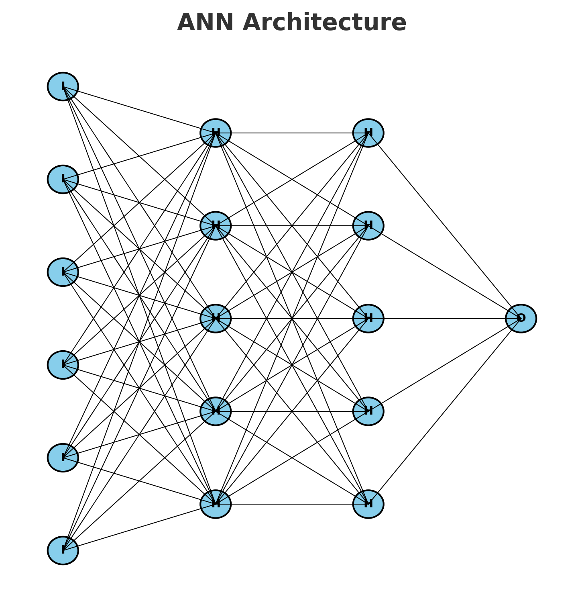

# 🔥 Customer Churn Prediction Using Artificial Neural Network (ANN)

This project focuses on predicting **customer churn** (whether a customer will leave a bank) using an **Artificial Neural Network (ANN)**. The goal is to help businesses take proactive actions to retain customers and reduce churn rate.

---

## 📁 Project Structure
```bash
ANN-Classification-churn/
│
├── artifacts/              # Saved models & preprocessing objects
│   ├── model.h5
│   ├── regression.h5
│   ├── scaler.pkl
│   ├── label_encode_gender.pkl
│   └── onehet_encoder_geo.pkl
│
├── data/                   # Dataset
│   └── Churn_Modelling.csv
│
├── notebooks/              # Jupyter notebooks for EDA & training
│   ├── exprements.ipynb
│   ├── predication.ipynb
│   └── salaryregresion.ipynb
│
├── src/                    # (Optional: for modular code in future)
│   └── utils.py
│
├── app.py                  # Application script for running predictions
├── requirements.txt        # Project dependencies
├── .gitignore
└── README.md               # Project documentation
```


📊 Dataset

Source: Churn Modelling Dataset

Features:

. Demographics → Age, Gender, Geography

. Banking details → Credit Score, Balance, Number of Products

. Customer behavior → Tenure, Active Member, Credit Card

. Target:  Exited → (1 = Churned, 0 = Not Churned)


🚀 Features

📌 Data preprocessing (encoding categorical features, scaling numerical features)

🧠 ANN model built with TensorFlow/Keras

📈 Model evaluation (Accuracy, Precision, Recall, F1, ROC-AUC)

💾 Saved trained model & encoders for future use

🌐 Ready for deployment with app.py


🧪 How to Run the Project
🔧 Setup

1 .Clone the repository:
```
git clone https://github.com/Dinesh-jangir/ANN-Classification-churn.git
cd ANN-Classification-churn

```
2 .Create and activate a virtual environment:
```
python -m venv venv
source venv/bin/activate   # On Windows: venv\Scripts\activate

conda activate venv\

```
3. Install dependencies:
```
pip install -r requirements.txt

```
4. Run the training notebook:
```
jupyter notebook notebooks/exprements.ipynb
```
5. Run predictions using:
```
streamlit run app.py

```
📈 Results

. Achieved high accuracy on test data

. Reliable churn predictions for new customers

. Demonstrates end-to-end ML workflow: Data → Preprocessing → ANN → Evaluation → Deployment

🚀 Future Improvements

. Hyperparameter tuning for deeper ANN optimization

. Handle class imbalance with SMOTE / class weights

. Deploy via Flask / FastAPI / Streamlit for real-time use


👨‍💻 Author

Dinesh Jangir
📌 3rd Year B.Tech Student | Aspiring Data Scientist

🔗 GitHub
 • LinkedIn


 ## 🧠 ANN Architecture

The following diagram illustrates the ANN used in this project:




